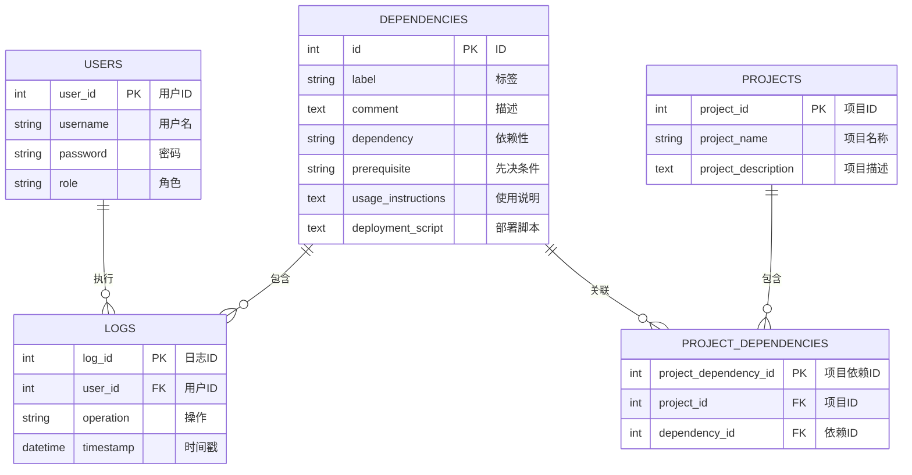
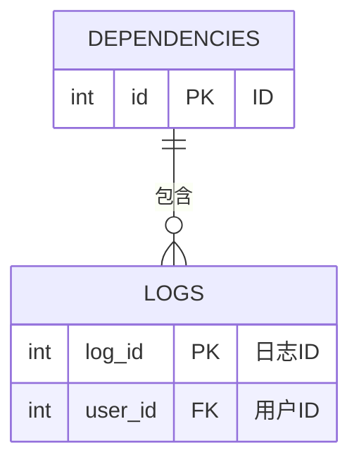
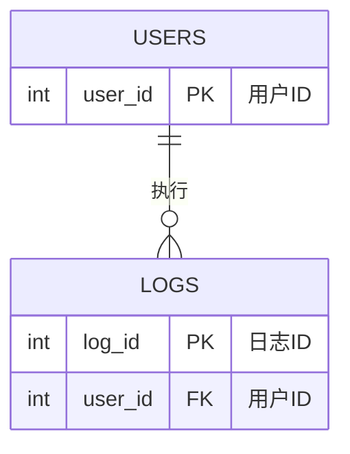
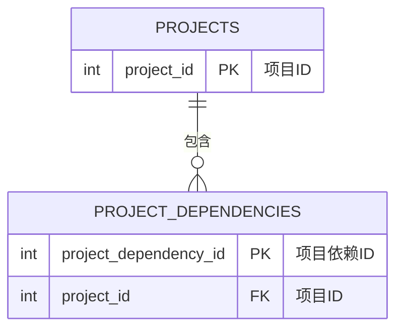
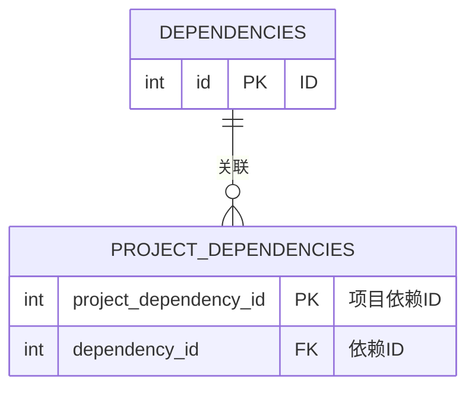

# 数据库设计说明书

## 1引言

### 1.1编写背景及目的
说明编写这份数据库设计说明书的背景及目的。

**背景**
在软件开发过程中，管理软件依赖项是一个复杂且耗时的任务。随着项目规模的扩大和开发环境的多样化，依赖项的一致性和可靠性变得尤为重要。传统的依赖管理方式往往依赖于手动操作，这不仅效率低下，而且容易出错。为了提高开发效率，确保环境的一致性和可靠性，EnvDock项目应运而生，旨在提供一个智能的依赖环境管理系统。

**目的**
编写这份数据库设计说明书的主要目的如下：
- 规范化管理：通过规范化的数据库设计，确保依赖环境管理系统的数据结构合理、数据冗余最小化，以及数据完整性和一致性得到保障。
- 提高效率：提供一个清晰的数据库设计蓝图，使得开发团队能够快速理解和实现系统的数据存储和操作逻辑，从而提高开发效率。
- 系统维护：随着系统的发展，数据库设计说明书将作为重要的文档，帮助维护人员理解和修改数据库结构，确保系统的可维护性和扩展性。
- 数据完整性：通过定义完整性约束，如主键、外键和唯一性约束，确保数据库中的数据准确无误，避免数据不一致和数据污染。
- 业务逻辑实现：为Python后端逻辑的实现提供数据层面的支持，使得业务逻辑能够高效、准确地与数据库进行交互。
- 跨平台支持：通过集中的元数据中心，支持跨平台的依赖管理，使得系统能够适应不同的开发环境和平台。
- 文档化：作为项目文档的一部分，数据库设计说明书记录了数据库的设计决策和细节，为项目的知识管理和传承提供支持。
- 沟通桥梁：作为开发团队、设计团队和项目管理者之间沟通的桥梁，确保所有相关人员对数据库设计有共同的理解。

### 1.2定义说明
列出本文档中可能用到的专业术语的定义等。

在本文档中，以下是一些可能用到的专业术语及其定义：
- **数据库（Database）**：一个系统化的数据集合，通常由结构化查询语言（SQL）管理，用于存储和管理数据。
- **实体（Entity）**：在现实世界中可以区分的对象，在数据库中通常对应一个表。
- **属性（Attribute）**：实体所具有的性质或特征，在数据库中对应表的列。
- **关系（Relationship）**：实体之间的逻辑联系，在数据库中通过外键等机制实现。
- **E-R图（Entity-Relationship Diagram）**：实体-关系图，是一种用于描述数据库结构的图形化工具，显示实体、属性和关系。
- **规范化（Normalization）**：数据库设计过程中减少数据冗余和依赖的过程，目的是优化数据库结构，提高数据完整性。
- **第一范式（1NF）**：每个字段都是不可分割的基本数据项，无重复组。
- **第二范式（2NF）**：满足1NF，并且非主键字段完全依赖于主键。
- **第三范式（3NF）**：满足2NF，并且非主键字段之间没有传递依赖。
- **BCNF（Boyce-Codd Normal Form）**：满足3NF，并且对于任何非平凡的函数依赖X → Y，X都是候选键。
- **主键（Primary Key）**：表中用于唯一标识每个记录的字段或字段组合。
- **外键（Foreign Key）**：表中的一个字段或字段组合，它在一个表中引用另一个表的主键。
- **索引（Index）**：数据库表中一个或多个列的值的集合，用于加快数据检索速度。
- **视图（View）**：一个虚拟表，其内容由SQL查询定义，不存储数据，而是动态生成。
- **权限（Privilege）**：允许或限制用户对数据库对象（如表、视图等）执行特定操作的能力。
- **数据字典（Data Dictionary）**：包含数据库中所有数据元素的定义、结构和关系的集合。
- **数据流图（Data Flow Diagram, DFD）**：一种图形化表示数据流和处理过程的工具。
- **依赖环境管理系统（Dependency Environment Management System）**：用于管理软件依赖项的系统，包括依赖项的下载、查找、更新、修改和卸载。

这些术语和定义有助于理解数据库设计和管理的基本概念，以及本文档中讨论的主题。

### 1.3参考资料
列出相关的参考资料：

## 2数据库设计

### 2.1需求分析设计（用户需求描述）
说明设计本数据库的用户需求，主要是要实现的功能描述。并列出本数据的数据字典及数据流图。

**用户需求描述**
EnvDock项目的用户需求主要集中在以下几个方面：
- 依赖项管理：用户需要能够添加、查询、更新和删除软件依赖项。
- 环境一致性：用户需要确保不同开发环境中依赖项的一致性。
- 依赖项搜索：用户需要能够根据标签或名称快速搜索依赖项。
- 依赖项更新：用户需要能够方便地更新已存在的依赖项信息。
- 一键部署：用户需要能够通过一键部署脚本来自动化环境搭建。
- 数据备份与恢复：用户需要能够备份和恢复依赖环境数据。
- 用户权限管理：系统需要支持不同级别的用户权限，以保护敏感操作。
- 日志记录：系统需要记录所有操作的日志，以便于问题追踪和系统维护。
- 跨平台支持：系统需要支持不同操作系统平台的依赖管理。
- 界面友好：系统需要提供用户友好的界面，以便于非技术用户也能轻松使用。

**数据字典**
数据字典是数据库设计中的一个重要组成部分，它详细描述了数据库中每个数据元素的定义、结构和关系。以下是EnvDock项目数据库的数据字典：

| 数据元素 | 数据类型 | 描述 | 约束 |
|----------|----------|------|------|
| id | INT | 依赖项的唯一标识 | 主键，自增 |
| label | VARCHAR(255) | 依赖项的标签或名称 | 唯一性约束 |
| comment | TEXT | 依赖项的描述或备注 | - |
| dependency | VARCHAR(255) | 依赖项的具体内容 | - |
| prerequisite | VARCHAR(255) | 依赖项的前置条件 | - |
| usage_instructions | TEXT | 依赖项的使用说明 | - |
| deployment_script | TEXT | 一键部署脚本 | - |

**数据流图**
数据流图（DFD）是一种图形化表示数据流和处理过程的工具。以下是EnvDock项目数据库的数据流图的简要描述：

外部实体：
- 用户：系统的最终用户，与系统进行交互。
- 系统管理员：负责系统维护和权限管理。

数据存储：
- 依赖项数据库：存储所有依赖项的详细信息。

处理过程：
- 依赖项管理：处理依赖项的添加、查询、更新和删除。
- 搜索处理：根据用户输入的关键字进行依赖项搜索。
- 一键部署：执行一键部署脚本，自动化环境搭建。
- 权限管理：管理用户权限，保护敏感操作。
- 日志记录：记录所有操作的日志。

数据流：
- 用户请求：用户通过界面发起请求，如添加依赖项、搜索依赖项等。
- 数据处理：系统根据请求进行相应的数据处理。
- 响应输出：系统将处理结果反馈给用户。

以下是一个简化的数据流图示例：
```
[用户] --> [依赖项管理] --> [依赖项数据库]
[用户] --> [搜索处理] --> [依赖项数据库]
[用户] --> [一键部署] --> [依赖项数据库]
[依赖项管理] --> [日志记录]
[搜索处理] --> [日志记录]
[一键部署] --> [日志记录]
[系统管理员] --> [权限管理] --> [依赖项数据库]
```

请注意，这是一个简化的描述，实际的数据流图会更加详细，包括更多的处理过程和数据存储。在实际的数据库设计过程中，数据流图是一个动态更新的文档，随着系统需求的变化而变化。

### 2.2概念结构设计（E-R图等）
说明本数据库将反映的现实世界中的实体、属性和它们之间的关系等，建立本数据库的E-R图。

**实体、属性和关系**
在EnvDock项目中，我们可以根据用户需求和数据字典来识别出以下实体、属性和它们之间的关系：

实体：依赖项（Dependencies）
- 属性：
  - id：依赖项的唯一标识（主键）。
  - label：依赖项的标签或名称。
  - comment：依赖项的描述或备注。
  - dependency：依赖项的具体内容。
  - prerequisite：依赖项的前置条件。
  - usage_instructions：依赖项的使用说明。
  - deployment_script：一键部署脚本。

实体：用户（Users）（如果系统需要用户权限管理）
- 属性：
  - user_id：用户的唯一标识（主键）。
  - username：用户的用户名。
  - password：用户的密码。
  - role：用户的角色或权限级别。

实体：操作日志（Logs）（如果系统需要记录操作日志）
- 属性：
  - log_id：日志条目的唯一标识（主键）。
  - user_id：执行操作的用户标识。
  - operation：执行的操作类型。
  - timestamp：操作的时间戳。

关系：
-- 用户和依赖项之间的关系可以是“管理”或“使用”，即用户可以添加、查询、更新和删除依赖项。
- 用户和操作日志之间的关系是“产生”，即用户的操作会被记录在操作日志中。

**E-R图**  
基于上述实体和关系，我们可以构建以下的E-R图：
在设计一个更全面的E-R图时，我们需要考虑EnvDock项目的所有实体及其关系。以下是一个更详细的E-R图，包括主要的实体和它们之间的关系。由于Mermaid的ER图语法限制，我们将使用英文字段名，并在注释中提供中文解释。
以下是包含连线的E-R图，使用Mermaid语法描述了实体之间的关系：

### 主要E-R图



### 各个主体的E-R图连线格式

#### 1. 依赖项（Dependencies）与日志（Logs）



#### 2. 用户（Users）与日志（Logs）



#### 3. 项目（Projects）与项目依赖（Project Dependencies）



#### 4. 依赖项（Dependencies）与项目依赖（Project Dependencies）



这些E-R图描述了EnvDock项目中实体之间的关系，包括依赖项、用户、日志、项目以及项目依赖。每个E-R图都展示了实体的属性和它们之间的连接关系。


### 2.3逻辑结构设计（模型优化）
对上述所建的E-R图转换为关系数据模式，并对模式以规范化理论为依据进行模型优化，说明优化的规范化程度及理由。

**R图到关系数据模式的转换**
根据E-R图，我们可以将实体和关系转换为关系数据模式（表结构）。

以下是转换后的关系数据模式：

**Dependencies（依赖项）**
- id INT
- label VARCHAR(255)
- comment TEXT
- dependency VARCHAR(255)
- prerequisite VARCHAR(255)
- usage_instructions TEXT
- deployment_script TEXT
- 主键：id

**Users（用户）**
- user_id INT
- username VARCHAR(255)
- password VARCHAR(255)
- role VARCHAR(255)
- 主键：user_id

**Logs（操作日志）**
- log_id INT
- user_id INT
- operation VARCHAR(255)
- timestamp DATETIME
- 主键：log_id
- 外键：user_id
- 引用 Users(user_id)

**模型优化**
为了优化这些关系数据模式，我们将依据规范化理论进行以下操作：
- 第一范式（1NF）：确保每个字段都是不可分割的基本数据项。所有字段都是原子性的，没有重复的组或数组。
- 第二范式（2NF）：确保表是1NF，并且所有非主键字段完全依赖于主键。消除部分依赖，每个非主键字段只依赖于主键。
- 第三范式（3NF）：确保表是2NF，并且非主键字段之间没有传递依赖。消除字段间的传递依赖。
- BCNF（Boyce-Codd Normal Form）：确保对于任何非平凡的函数依赖 X → Y，X 都是候选键。这是3NF的加强版，用于处理3NF中可能存在的异常。

**规范化程度及理由**
- Dependencies 表已经是3NF，因为所有非主键字段（label, comment, dependency, prerequisite, usage_instructions, deployment_script）都完全依赖于主键（id），并且没有字段间的传递依赖。
- Users 表同样是3NF，因为所有非主键字段（username, password, role）都完全依赖于主键（user_id），并且没有字段间的传递依赖。
- Logs 表也是3NF，因为所有非主键字段（operation, timestamp）都完全依赖于主键（log_id），并且user_id作为外键，确保了引用的完整性。没有字段间的传递依赖。

优化理由：
- 减少数据冗余：规范化有助于减少数据冗余，提高数据的一致性和完整性。
- 提高数据完整性：规范化确保了数据的完整性，避免了更新异常、插入异常和删除异常。
- 优化查询性能：规范化的数据结构可以提高查询性能，尤其是在大型数据库中。
- 易于维护：规范化的数据结构更易于维护和扩展。

通过上述优化，EnvDock项目的数据库设计将更加健壮、高效和易于维护。

## 3数据库实施

### 3.1数据库的建立
说明程序的开发环境，建库。

**程序的开发环境**
在建立数据库之前，需要确保开发环境已经搭建好，以下是EnvDock项目可能需要的开发环境：
- 操作系统：Windows、Linux（如Ubuntu）或macOS。
- 编程语言：Python 3.8 或更高版本。
- 数据库管理系统：MySQL Server（推荐5.7或更高版本）。
- Python数据库接口：mysql-connector-python 或 SQLAlchemy 用于Python与MySQL数据库的交互。
- 开发工具：代码编辑器或集成开发环境（IDE），如PyCharm、VSCode等。
- 版本控制：Git用于版本控制，配合GitHub、GitLab或Bitbucket等远程仓库。
- 其他依赖：根据requirements.txt文件中的依赖进行安装。

**建库步骤**
以下是在MySQL中建立数据库的具体步骤：
- 安装MySQL Server：Windows：从MySQL官网下载安装程序并安装。Ubuntu：使用以下命令安装：
  ```bash
  sudo apt update
  sudo apt install mysql-server
  ```
- 配置MySQL：
  - 设置MySQL root用户密码。
  - 配置MySQL服务器以允许远程连接（如果需要）。
- 创建数据库：登录MySQL服务器：
  ```sql
  mysql -u root -p
  ```
  创建名为envharbor的数据库：
  ```sql
  CREATE DATABASE envharbor CHARACTER SET utf8mb4 COLLATE utf8mb4_unicode_ci;
  ```
  选择数据库：
  ```sql
  USE envharbor;
  ```

### 3.2建表及数据载入
建立数据库中所涉及的所有表格，并载入部分测试数据。

我们可以创建三个主要的数据表：dependencies、users和logs。以下是创建这些数据表的SQL语句：

**创建dependencies表**
```sql
CREATE TABLE dependencies (
  id INT AUTO_INCREMENT PRIMARY KEY,
  label VARCHAR(255) NOT NULL,
  comment TEXT,
  dependency VARCHAR(255),
  prerequisite VARCHAR(255),
  usage_instructions TEXT,
  deployment_script TEXT,
  INDEX(label)  -- 创建索引以优化基于标签的搜索
) ENGINE=InnoDB DEFAULT CHARSET=utf8mb4 COLLATE=utf8mb4_unicode_ci;
```

**创建users表**
```sql
CREATE TABLE users (
  user_id INT AUTO_INCREMENT PRIMARY KEY,
  username VARCHAR(255) NOT NULL UNIQUE,
  password VARCHAR(255) NOT NULL,
  role VARCHAR(255) DEFAULT 'user'  -- 默认角色为'user'
) ENGINE=InnoDB DEFAULT CHARSET=utf8mb4 COLLATE=utf8mb4_unicode_ci;
```

**创建logs表**
```sql
CREATE TABLE logs (
  log_id INT AUTO_INCREMENT PRIMARY KEY,
  user_id INT,
  operation VARCHAR(255) NOT NULL,
  timestamp DATETIME DEFAULT CURRENT_TIMESTAMP,
  FOREIGN KEY (user_id) REFERENCES users(user_id) ON DELETE SET NULL  -- 外键约束，删除用户时日志中的user_id设为NULL
) ENGINE=InnoDB DEFAULT CHARSET=utf8mb4 COLLATE=utf8mb4_unicode_ci;
```

说明 字符集和排序规则：所有表都使用utf8mb4字符集和utf8mb4_unicode_ci排序规则，以支持全Unicode字符集。索引：在dependencies表的label字段上创建索引，以优化基于标签的搜索查询。外键约束：logs表中的user_id字段引用users表的user_id字段。如果对应的用户被删除，日志中的user_id将被设置为NULL，这样可以避免级联删除日志条目。默认值：users表的role字段默认值为user，表示新用户默认的角色。时间戳：logs表的timestamp字段默认为当前时间戳，记录操作发生的时间。通过执行上述SQL语句，你可以在envharbor数据库中成功创建所需的数据表，为EnvDock项目的数据存储和管理打下基础。

### 3.3数据查询及增、删、改操作
SQL语句并结合操作结果截图说明。

**数据查询（Select）**
- 查询所有依赖项：
  ```sql
  SELECT * FROM dependencies;
  ```
- 根据标签查询依赖项：
  ```sql
  SELECT * FROM dependencies WHERE label = '特定标签';
  ```
- 查询特定用户的日志：
  ```sql
  SELECT * FROM logs WHERE user_id = (SELECT user_id FROM users WHERE username = '特定用户名');
  ```

**数据插入（Insert）**
- 插入新的依赖项：
  ```sql
  INSERT INTO dependencies (label, comment, dependency, prerequisite, usage_instructions, deployment_script) 
  VALUES ('依赖项标签', '依赖项描述', '依赖内容', '前置依赖', '使用说明', '部署脚本');
  ```
- 插入新用户：
  ```sql
  INSERT INTO users (username, password, role) 
  VALUES ('新用户名', '密码哈希值', 'user');
  ```

**数据更新（Update）**
- 更新依赖项信息：
  ```sql
  UPDATE dependencies 
  SET label = '新标签', comment = '新描述' 
  WHERE id = 1;
  ```
- 更新用户角色：
  ```sql
  UPDATE users 
  SET role = 'admin' 
  WHERE username = '特定用户名';
  ```

**数据删除（Delete）**
- 删除依赖项：
  ```sql
  DELETE FROM dependencies WHERE id = 1;
  ```
- 删除用户：
  ```sql
  DELETE FROM users WHERE username = '特定用户名';
  ```

执行SQL语句并截图
打开你的数据库管理工具，如MySQL Workbench。
连接到你的envharbor数据库。
执行上述SQL语句，你可以在查询窗口中输入这些语句并执行。
查看操作结果，执行查询后，结果会显示在下方的面板中。
截图，你可以使用截图工具（如Windows的Snipping Tool或macOS的Screenshot）来捕捉操作结果的截图。

请记得在执行插入（Insert）操作时，如果涉及到密码，应该使用密码哈希值而不是明文密码。对于更新（Update）和删除（Delete）操作，确保你指定的条件能够精确地定位到要操作的记录，以避免意外修改或删除数据。

### 3.4用户权限分配
区分管理员和普通用户权限，通过授权或回收权限语句将用户对表的操作权限进行管理，可建立视图。

**创建用户**
首先，你需要创建两个用户，一个用于管理员，一个用于普通用户。
```sql
-- 创建管理员用户
CREATE USER 'admin'@'localhost' IDENTIFIED BY 'strong_password';

-- 创建普通用户
CREATE USER 'user'@'localhost' IDENTIFIED BY 'strong_password';
```

**分配权限**
为管理员分配权限
管理员通常需要所有的权限来管理数据库。
```sql
-- 给管理员用户授权所有权限
GRANT ALL PRIVILEGES ON envharbor.* TO 'admin'@'localhost';
```

为普通用户分配权限
普通用户可能只需要查询数据的权限，以及对自己数据的插入和更新权限。
```sql
-- 给普通用户授权查询权限
GRANT SELECT ON envharbor.* TO 'user'@'localhost';

-- 给普通用户授权对自己数据的插入和更新权限（假设有一个用户ID作为标识）
GRANT INSERT, UPDATE ON envharbor.dependencies TO 'user'@'localhost';
```

**回收权限**
如果你需要回收之前分配的权限，可以使用REVOKE语句。
```sql
-- 从普通用户回收所有权限
REVOKE ALL PRIVILEGES ON envharbor.* FROM 'user'@'localhost';

-- 从管理员回收特定表的权限
REVOKE SELECT ON envharbor.users FROM 'admin'@'localhost';
```

**创建视图**
视图可以作为另一种权限管理工具，允许你为普通用户提供特定数据的访问，而无需直接访问实际的表。
```sql
-- 创建视图，只包含对普通用户必要的依赖项信息
CREATE VIEW user_dependencies AS
SELECT id, label, comment, dependency, prerequisite, usage_instructions, deployment_script
FROM dependencies;

然后，你可以给普通用户授权访问这个视图的权限。
```sql
-- 给普通用户授权视图查询权限
GRANT SELECT ON user_dependencies TO 'user'@'localhost';
```

这样，普通用户只能查询视图中的数据，而不能直接访问dependencies表。

**应用权限**
在分配权限后，用户需要重新连接数据库以使权限生效。
请注意，这些示例假设你正在使用localhost作为主机，并且你的MySQL用户是基于用户名和主机的。在实际应用中，你可能需要根据你的具体环境和安全策略调整这些语句。此外，使用视图和精细的权限控制可以提高数据库的安全性，但也需要更多的维护和管理。

### 3.5数据库试运行及运行
说明本设计的数据库运行效果，目前存在的问题及后续改进措施。

## 4代码附录

## 5团队成员及分工
说明该组的参与人员（姓名、学号、班级）及每个人的主要负责分工。

## 6心得体会
说明通过本设计个人及团队得到的一些心得体会和经验值。
数据库设计与实现是一个需要团队齐心合作的工作，希望大家在实现的过程中，能够互相交流，互相协助，拥有高度的团队合作意识，积极配合负责人的总体协调安排，在充分发挥个人特长与才能的同时，也能够帮助队友，共同完成该系统的设计与实现工作。
```

这是优化后的完整`.md`文档，包括了格式调整和涉及英语部分的汉化内容。

